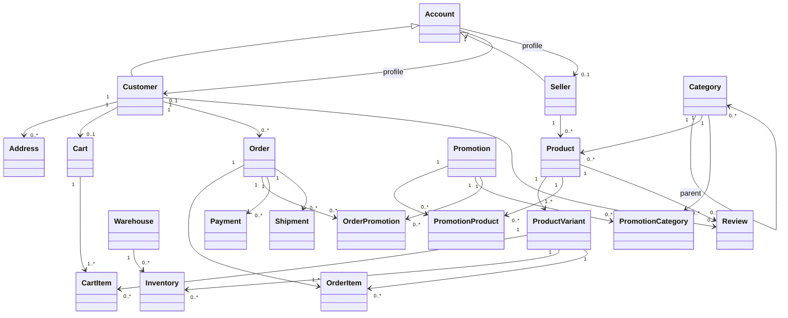

# Thiết kế EER và ERD

## 1. EER: quyết định mô hình

### Supertype / subtype

`Account` là supertype chứa identity/login và trạng thái tài khoản. `Customer` và `Seller` là hai subtype **overlapping, partial**:

- Overlapping: một account có thể vừa mua hàng vừa bán hàng.
- Partial: account chưa nhất thiết phải là customer hoặc seller.
- `Admin` là vai trò quản trị có thể quản lý bằng role ở Account thay vì thêm một subtype nghiệp vụ vào schema lõi.

### Các cardinality chính

- Account 1 — 0..1 Customer
- Account 1 — 0..1 Seller
- Customer 1 — N Address
- Seller 1 — N Product
- Product 1 — N ProductVariant
- Category 1 — N Category (parent/child)
- Product N — 1 Category
- Customer 1 — 0..1 active Cart; Cart 1 — N CartItem
- ProductVariant 1 — N Inventory; Warehouse 1 — N Inventory
- Product N — N Promotion qua PromotionProduct
- Category N — N Promotion qua PromotionCategory
- Customer 1 — N Order; Order 1 — N OrderItem
- ProductVariant 1 — N OrderItem
- Order N — N Promotion qua OrderPromotion
- Order 1 — N Payment; Order 0..N Shipment; Product 1 — N Review

## 2. EER Mermaid

Nguồn: [`../diagrams/eer.mmd`](../diagrams/eer.mmd).

## 3. ERD vật lý

Nguồn Mermaid: [`../diagrams/erd.mmd`](../diagrams/erd.mmd). Nguồn dbdiagram: [`../diagrams/relational-schema.dbml`](../diagrams/relational-schema.dbml).

ERD vật lý phải thể hiện PK, FK, UNIQUE và các quan hệ N:N được tách thành bảng associative. `Inventory`, `PromotionProduct`, `PromotionCategory`, `OrderPromotion` là các bảng trung gian quan trọng.

## 4. Mapping EER → relational

| EER                     | Relational mapping                           |
| ----------------------- | -------------------------------------------- |
| Account supertype       | `account`                                  |
| Customer subtype        | `customer(account_id PK/FK)`               |
| Seller subtype          | `seller(account_id PK/FK)`                 |
| Recursive Category      | `category(parent_category_id FK category)` |
| M:N Promotion–Product  | `promotion_product`                        |
| M:N Promotion–Category | `promotion_category`                       |
| M:N Order–Promotion    | `order_promotion`                          |
| M:N Variant–Warehouse  | `inventory`                                |
| Cart line               | `cart_item(cart_id, variant_id)`           |
| Order line              | `order_item(order_id, variant_id)`         |

## 5. Integrity không biểu diễn đầy đủ bằng ERD

Các invariant như stock availability, valid order transition, review eligibility, category cycle và total consistency cần được thể hiện thêm bằng CHECK/FK/UNIQUE và trigger/procedure. ERD chỉ biểu diễn cấu trúc, không đủ để biểu diễn toàn bộ hành vi nghiệp vụ.
